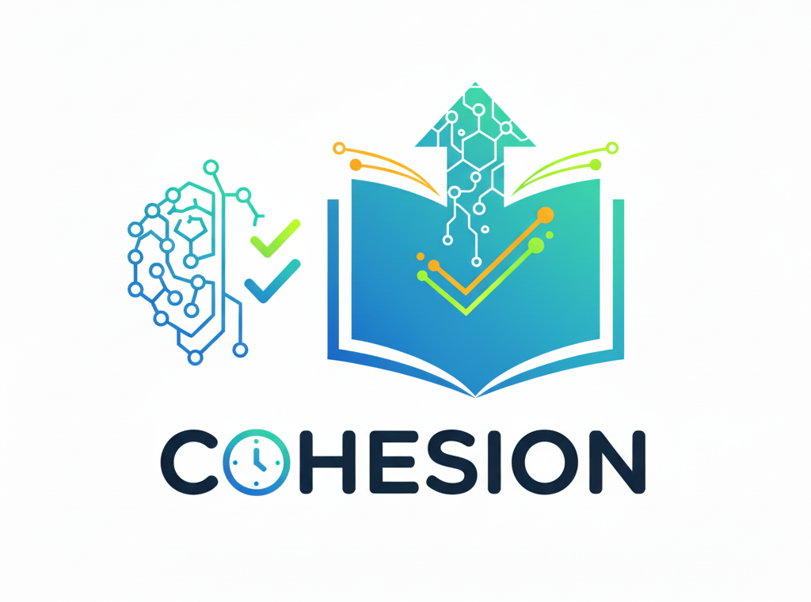

<div align="center">
  
  <!-- Logo placeholder - you can replace this with your actual logo -->
  
  
  # Cohesion - CBT Quiz Platform
  
  *Building Knowledge Through Connected Learning*
  
  [](https://opensource.org/licenses/MIT)
  [](https://nodejs.org/)
  [](https://www.mongodb.com/)
  [](https://expressjs.com/)
  [](https://cohesion-quizapp.onrender.com/)
  
  ## 🌐 Live Demo
  
  **[Try Cohesion Now →](https://cohesion-quizapp.onrender.com/)**
  
  Experience the full power of Cohesion without any setup! The live demo is hosted on Render and ready to use.
  
  ### Quick Demo Access:
  - 🎓 **Student**: Register with any email and start taking quizzes
  - 👨‍🏫 **Admin**: Use `admin@gmail.com` for admin privileges and question management
  
</div>

---

## 🎯 About Cohesion

**Cohesion** is a modern, feature-rich Computer-Based Testing (CBT) platform built with the MEN stack (MongoDB, Express.js, Node.js). Designed to bring learners and educators together, Cohesion provides a seamless experience for creating, managing, and taking quizzes with intelligent scoring and comprehensive analytics.

### 🌟 Why Cohesion?

Cohesion represents the perfect blend of simplicity and power in educational technology. Our platform empowers educators to create engaging assessments while providing students with an intuitive testing environment that promotes learning and growth.

**Key Highlights:**
- 🔐 **Secure Authentication**: JWT-based security ensuring data protection
- 📊 **Smart Scoring**: Advanced calculation with positive and negative marking
- 🎨 **Modern UI**: Clean, responsive design built with TailwindCSS
- 📁 **Bulk Operations**: Efficient question management with JSON import
- 📈 **Detailed Analytics**: Comprehensive result breakdown and feedback

## ✨ Features

### 🔐 Authentication & Security
- **Secure Registration**: Password hashing with bcrypt encryption
- **JWT Authentication**: Token-based secure login system
- **Role-based Access**: Separate admin and user interfaces

### 👨‍🏫 Admin Capabilities
- **Dual Question Management**:
  - 📝 **Manual Creation**: Add questions one by one via intuitive forms
  - 📤 **Bulk Upload**: Import questions from JSON files for efficiency
- **Admin Dashboard**: Centralized control panel for all operations

### 🎓 Student Experience
- **Interactive Quiz Interface**: Clean, distraction-free testing environment
- **Real-time Feedback**: Immediate response tracking during quizzes

### 📊 Advanced Scoring System
- **Intelligent Calculation**: Each question is scored as follows:
  - ✅ **Correct**: Full marks awarded
  - ❌ **Incorrect**: Negative marks deducted (configurable)
  - ⏸️ **Unanswered**: Zero points (no penalty)
- **Comprehensive Results**: 
  - Total points vs. possible points
  - Per-question breakdown with visual indicators
  - Color-coded answer feedback (Green: Correct, Red: Incorrect, Gray: Unanswered)

### 🎨 User Interface
- **Modern Design**: Built with TailwindCSS for responsive, mobile-friendly experience
- **EJS Templating**: Dynamic content rendering for personalized user experience

## 📁 Project Structure

```
cohesion/
├── 📄 app.js                    # Main application server
├── 📦 package.json              # Dependencies and scripts
├── 🗂️ models/
│   ├── 👤 user.js               # User schema/model
│   └── ❓ questions.js          # Question schema/model
├── 🎨 public/                   # Static assets (CSS, JS, images)
├── 🛡️ middleware/
│   └── auth.js                  # Authentication middleware
└── 👀 views/                    # EJS templates
    ├── 📝 index.ejs             # User registration page
    ├── 🔐 login.ejs             # Login interface
    ├── 🏠 admin_landing_page.ejs # Admin dashboard
    ├── ➕ admin_create_questions.ejs # Manual question creation
    ├── 📤 admin_upload.ejs      # Bulk question upload
    ├── 🎯 loggedin.ejs          # Quiz interface
    └── 📊 result.ejs            # Results & analytics
```

## 🚀 Quick Start

### 🌐 **Option 1: Try the Live Demo (Recommended)**

**[🔗 Launch Cohesion →](https://cohesion-quizapp.onrender.com/)**

No installation required! Jump right into the action:
- **Students**: Register and start taking quizzes immediately
- **Educators**: Use `admin@gmail.com` for instant admin access

---

### 💻 **Option 2: Local Development Setup**

Want to run Cohesion locally or contribute to the project?

#### Prerequisites
- Node.js (v16.0 or higher)
- MongoDB (local or cloud instance)
- Git

#### Installation Steps

1. **Clone the repository**
   ```bash
   git clone https://github.com/Nortcele7/CBT-Quiz-App.git
   cd CBT-Quiz-App
   ```

2. **Install dependencies**
   ```bash
   npm install
   ```

3. **Configure MongoDB**
   - Ensure MongoDB is running on `mongodb://127.0.0.1:27017/authtestapp`
   - Or update the connection string in `models/user.js` and `models/questions.js`

4. **Start the application**
   ```bash
   node app.js
   ```

5. **Access locally**
   - Open your browser and navigate to `http://localhost:3000`
   - Create a new account or use admin credentials

> **💡 Pro Tip**: Try the [live demo](https://cohesion-quizapp.onrender.com/) first to see if Cohesion meets your needs before setting up locally!

## 🎮 How to Use Cohesion

### For Students 🎓
1. **Register**: Create your account on the home page
2. **Login**: Access your personalized dashboard
3. **Take Quiz**: Navigate through questions at your own pace
4. **View Results**: Get detailed feedback with performance analytics

### For Educators 👨‍🏫
1. **Admin Access**: Login with admin credentials (`admin@gmail.com`)
2. **Question Management**: Choose between:
   - **Manual Creation**: Add individual questions with custom parameters
   - **Bulk Upload**: Import questions via JSON files for efficiency
3. **Monitor Performance**: Track student progress and results

### Default Admin Credentials
- **Email**: `admin@gmail.com`
- **Access**: Use this email during registration for admin privileges

## 🛠️ Technology Stack

<div align="center">

| Technology                                                                                                             | Purpose         | Version |
| ---------------------------------------------------------------------------------------------------------------------- | --------------- | ------- |
|              | Backend Runtime | 16.0+   |
|                                       | Web Framework   | Latest  |
|                | Database        | Latest  |
|  | Styling         | Latest  |
|                                                     | Templating      | Latest  |

</div>

### Core Dependencies
```json
{
  "express": "^5.1.0",
  "mongoose": "^8.18.1", 
  "ejs": "^3.1.10",
  "bcrypt": "^6.0.0",
  "jsonwebtoken": "^9.0.2",
  "cookie-parser": "^1.4.7",
  "multer": "^1.4.5-lts.1"
}
```

## 🤝 Contributing

We welcome contributions to make Cohesion even better! Here's how you can help:

1. **Fork** the repository
2. **Create** a feature branch (`git checkout -b feature/amazing-feature`)
3. **Commit** your changes (`git commit -m 'Add amazing feature'`)
4. **Push** to the branch (`git push origin feature/amazing-feature`)
5. **Open** a Pull Request

## 📝 License

This project is licensed under the **MIT License** - see the [LICENSE](LICENSE) file for details.

## 🌟 Acknowledgments

- Built with ❤️ by the Cohesion team
- Special thanks to the open-source community
- Powered by modern web technologies

---

<div align="center">
  
  **Made with ❤️ for Education**
  
  [🌐 Try Live Demo](https://cohesion-quizapp.onrender.com/) | [⭐ Star this repo](https://github.com/Nortcele7/CBT-Quiz-App) | [🐛 Report Issues](https://github.com/Nortcele7/CBT-Quiz-App/issues) | [💡 Request Features](https://github.com/Nortcele7/CBT-Quiz-App/issues)
  
</div>
